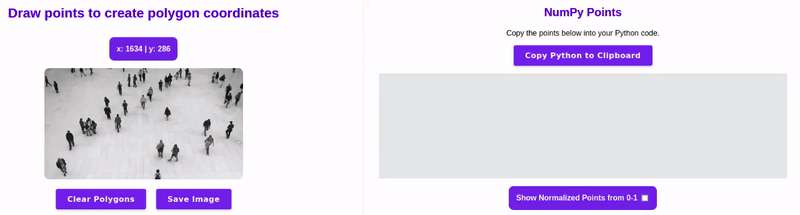

# 🚀 Moving Zone Annotators
**A repository that utilizes Supervision 🦊 library and enables user to move zone annotators simply by clicking on video frame** 🌟

## 🖥️ Installation
`git clone https://github.com/xaristeidou/moving-zone-annotators.git`

### Libraries installation

#### PyTorch installation (skip if installed already)
It is recommended to install PyTorch before running requirements installation, especially if you want to download PyTorch with CUDA.

https://pytorch.org/get-started/locally/

For Linux with latest CUDA run:

`pip3 install torch torchvision torchaudio`  

For Windows with latest CUDA run:

`pip3 install torch torchvision torchaudio --index-url https://download.pytorch.org/whl/cu121`  

#### Requirements

`pip install ultralytics`  
`pip install supervision --no-deps`

<u>Note:</u> Supervision installation for some reason will install opencv-python-headless, which not support GUI, even when pip install supervision[desktop]. If you get any error from opencv package after installing supervision library, just uninstall opencv and re-install it.
  

## 💪 Run/Execute
Move to repository path

`cd path_to_folder/`  

Run with default arguments:

`python3 moving_polygone_zone.py`  

Specify arguments using parser like following:

`python3 moving_polygone_zone.py --source people_walking.mp4 --weights yolov8m.pt --polygone polygone.yaml`  

You can specify some of the arguments you only want to modify, for example use camera input 0:

`python3 moving_polygone_zone.py --source 0`

## █ 🖊️ Specify polygone zone
You can specify any shape of zone you want:  

🔶 Triangle (3 points)  
🔶 Rectangle (4 points)  
🔶 Any polygone shape with >= 5 points

Open `polygone.yaml` and modify it as needed for your case in yaml format.  

### Find coordinates of polygone using PolygonZone tool from Roboflow:

https://roboflow.github.io/polygonzone/

1) Open the above link ⬆️ 
2) Drag and drop an image
3) Draw the your own polygone
4) Press Enter to close enclose the polygon
5) Use the calculated points in yaml file   

## 🕵️ Detection model selection

By default **YOLOv8** model is utilized. If you don't have the model weights, these will be directly downloaded from Ultralytics API. You can specify any of `yolov8n.pt`, `yolov8s.pt`, `yolov8m.pt`, `yolov8l.pt`, `yolov8x.pt` model weights you want.

Other models that can be used through Ultralytics:

🔷 YOLOv3  
🔷 YOLOv5  
🔷 YOLOv6  
🔷 YOLO-NAS  
🔷 RT-DETR

<u>Note:</u> Small modificationas may needed deepending in the model selection. All YOLO models (except YOLO-NAS) used by Ultalytics run through YOLO class. Otherwise for NAS and RT-DETR you need to modify and import each Class respectively. 

For more details visit Ultralytics Models page:  
https://docs.ultralytics.com/models/   

💠 More models can be used but manual download and installation of packages is required. Supervision supports models like `Detectron2`, `MMDetection`, `Transformers` and more. To run such models you need to make small modifications in the code by specify in `sv.Detections.from_<inference_model>()` the model you use.  
What basically happens is that `Detections` class <u>will transform detection from any model results you use in a specific **unified** format</u> so you don't mess with such operations and focus on your use case only. More details can be found in Detections page of Supervision API using the following link:  
https://supervision.roboflow.com/detection/core/